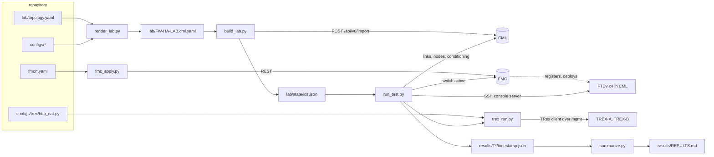

# How this lab was built and run

A walkthrough for readers who want to understand the method, not just the
result. It assumes you know what CML, FMC, FTD failover, and BGP are, and
nothing about this project.

## 1. The question, and the shape of the answer

The design under test puts two FTD Active/Standby pairs across two colocation
sites 25 ms apart, with every VLAN a pair uses stretched over one layer 2
interconnect. The design owner wanted to know whether stateful failover survives
that latency and what the real failure modes are, before buying hardware.

The answer had to be **observed, not argued**, and it had to be repeatable: nine
scenarios, each run under traffic, each producing numbers a design review could
use. That constraint shaped everything below. A lab you click together in the
CML UI cannot be re-run, diffed, or handed to someone else.

## 2. Three rules

1. **The repository is the lab.** Every device config, the topology, the link
   conditioning, and the FMC policy live in files. A script renders them into
   CML's native import format and another script imports that file. If a value
   is not in the repository, it is not part of the lab. `scripts/check_drift.py`
   exports the live lab and diffs it against the rendered file to prove it.
2. **Scripts are idempotent and talk to APIs.** `fmc_apply.py` looks every
   object up by name before creating it, so any step can be re-run. Nothing is
   configured through a GUI. The only console interaction is scripted
   (`console.py`), for platforms without a usable API on the data path.
3. **Every test run restores the baseline and records everything.** A scenario
   is: restore baseline, start traffic, snapshot, trigger, observe on a timer,
   snapshot, save JSON, restore baseline. The summary table is generated from
   the JSON, never typed.

## 3. The pipeline

Read it left to right. Files become a CML lab; YAML becomes FMC configuration;
the test runner drives all three systems and writes JSON; the summary is derived
from the JSON.

## 4. Tour of the files

| Path | What it is | Why it exists |
| --- | --- | --- |
| `docs/build-package.md` | The design and runbook, written as a spec for an LLM agent | It is the single source of truth. Everything else was generated from it or checked against it |
| `lab/topology.yaml` | 21 nodes, 43 numbered links, positions, tags, per-link conditioning | Human-readable topology. Link numbers match the build package's link table |
| `configs/` | Day-0 configuration per node, in the format each node type expects | Routers get `iosxe_config.txt`, switches `ios_config.txt`, FTDs a JSON `day0-config`, TRex a shell `node.cfg`, Docker nodes a `config.json` plus `boot.sh` |
| `lab/FW-HA-LAB.cml.yaml` | The rendered import file, configs embedded | Portable: imports into any CML with the same node definitions. Generated, never edited |
| `fmc/*.yaml` | Zones, objects, devices, HA pairs, NAT, access policy | Declarative input for `fmc_apply.py` |
| `scripts/lablib.py` | Credentials, cached sessions, CML and FMC REST helpers, repository paths | Every other script imports it; it is the only place that knows how to authenticate |
| `scripts/console.py` | A `pexpect` driver for CML's SSH console server | FTD CLI, Docker hosts, and TRex have no API reachable from the workstation on the data path; the console does |
| `scripts/trex_run.py` | Starts, stops, and reads the TRex nodes | Uses the vendored TRex 2.87 Python client over the management network |
| `scripts/run_test.py` | The scenario runner | One command per scenario, with options for pair, latency, loss, hold time, connection rate |
| `scripts/summarize.py` | JSON to Markdown | Picks the newest run per scenario variant and builds the table |
| `results/` | Everything the runs produced | JSON timelines, console logs, the summary, the written-up report |

## 5. How the scripts talk to the lab

**CML REST** (`lablib.cml`): bearer token from `/api/v0/authenticate`, cached
for 25 minutes under `.cache/`. Used for import, topology read-back, node and
link start/stop, disk wipe, configuration load, link conditioning
(`PATCH .../links/<id>/condition`), and export. `build_lab.py` numbers the links
by matching endpoint pairs to `topology.yaml`, because CML regenerates link
labels on import.

**FMC REST** (`lablib.fmc`): Basic auth to `generatetoken`, then the
`X-auth-access-token` and `DOMAIN_UUID` headers on every call. Paged
collections are read in full (`fmc_all`). `fmc_apply.py` runs steps in order:
objects, access policy, device registration (with a wait on
`deploymentStatus`), data interfaces on each pair's primary, HA pair creation
(bootstrap with separate failover and state links, then a wait for
Active/Standby), standby addresses and interface monitoring, static routes,
NAT policies and their assignment to the pair, deploy.

**CML SSH console server** (`console.py`): `ssh <cml-user>@<cml-host>` on port
22 lands in a `consoles>` shell where `open /<lab>/<node>/0` attaches to a
node's serial console. `pexpect` handles login prompts, the pager, and prompt
detection per platform. `Session` keeps a console open for repeated polling,
which the test runner does every five seconds.

**TRex** (`trex_run.py`): the TRex 2.87 client from `vendor/trex-core` connects
to each node's management address on ports 4500/4501, loads the ASTF profile
with tunables (client range, server range, connections per second, hold time),
and reads global and per-side TCP counters.

**The CML MCP server** (`.mcp.json`): during the build, the agent used
`cml-mcp[pyats]` for interactive verification: per-link conditioning, packet
capture, and a pyATS/Unicon CLI tool for the IOS XE nodes (BGP, HSRP, trunk,
and spanning-tree checks). The scripts do not depend on it; it is how the agent
looked at the lab while building it.

## 6. A test run, step by step

`run_test.py T2 --pair A --hold 120` does this:

1. **Restore baseline.** Start any stopped trunk or node, reset the trunk
   conditioning to the 25 ms setting, restore the full VLAN list on the inside
   inter-site trunk, and switch each HA pair back to primary-active through the
   FMC if a previous run left it the other way round (retried, because a switch
   issued while the standby is still bulk-syncing is silently ignored).
2. **Clear FTD tables.** `clear conn` and `clear asp drop` on all four units.
   TRex reuses source ports between runs, and stale connections from the last
   run would otherwise collide with the new SYNs.
3. **Open console sessions** on the two units of the pair under test.
4. **Start traffic.** Both TRex nodes at the requested connection rate with a
   configurable hold per connection, plus one long-lived `iperf3` from `CLIENT`
   to `SRV-A` through pair A's static NAT.
5. **Settle**, then snapshot: `show failover` on both units, TRex counters, the
   last `iperf3` line, FMC's view of the pair, drop counters.
6. **Trigger.** For T2, an FMC "switch active" on the pair. Other scenarios
   prune a VLAN from a trunk, stop a link, stop a node, or change conditioning.
7. **Observe** for the hold window: every five seconds, failover state on each
   unit, TRex flow counts and TCP error counters, the `iperf3` tail. The first
   sample whose state differs from the pre-snapshot is the detection time.
8. **Post-snapshot** and derived events: drop-reason deltas on the unit that
   became active, connection drops and retransmit deltas from TRex, whether the
   `iperf3` session survived (no reset lines, and intervals kept arriving).
9. **Save** `results/T2/<timestamp>.json` with the timeline, both snapshots, the
   events, and the full log. Then restore the baseline again.

## 7. The scenarios and their triggers

| ID | Scenario | Mechanism in the lab |
| --- | --- | --- |
| T1 | Baseline | Nothing failed; proves the pipeline and the traffic |
| T2 | Planned failover | FMC REST: switch active on the pair |
| T3 | State link failure | Prune VLAN 901 from the inside inter-site trunk, then switch active |
| T4 | Failover link failure | Prune VLAN 900 from the same trunk |
| T5 | Full interconnect failure | CML: stop both inter-site links |
| T6 | Site failure | CML: stop both East firewalls |
| T7 | Latency sweep | CML conditioning on both trunks, then T2 |
| T8 | Degraded link | CML conditioning with 1% then 5% loss, observe |
| T9 | Edge router failure | CML: stop RTR-1 |

## 8. What the results said

Planned failover moves the active role between sites in about five seconds and
established sessions survive, unchanged from 3 ms to 40 ms of round trip. With
the state link cut, the next failover resets every session, which is the state
link's value shown directly. Cutting only the failover link does not cause
split-brain, because hellos also cross the monitored data interfaces. Cutting
the whole interconnect does: both pairs went dual-active at about 17 seconds.
And firewall HA does nothing for an edge-router failure: on default BGP timers
the site blackholed for the whole window, and only aggressive BGP hold timers on
every session (not BFD alone) brought recovery down to about 16 seconds.
Details and the drop-reason breakdown are in `results/RESULTS.md`.

## 9. Things learned the hard way

Each of these cost time and is now encoded in a file so nobody pays for it twice.

- **External connector.** On this CML host only `bridge1` reaches the
  management network; the connector's configuration must be the device name,
  not the label. Carried as `config_inline` on `EXT-CONN` in `topology.yaml`.
- **CML latency is per direction**, and the virtual path adds about 1.5 ms each
  way. A setting of 11 on each trunk measured 25 ms round trip. The sweep
  values in `run_all.sh` are CML settings, not target RTTs.
- **FTD 7.7 reserves part of `203.0.113.0/24`** for its internal
  management-to-data-plane path and the FMC rejects overlapping data
  interfaces. Public space moved to `198.51.100.0/24`.
- **The TRex image** starts stateless on every boot, after day-0, and lacks
  `astf_schema.json`. The day-0 script restores the schema and launches a
  detached job that waits for the launcher, appends port gateways, kills the
  stateless process, clears `/var/run/dpdk`, and respawns in ASTF mode. Two
  traps: `/etc/local.d` scripts written by day-0 do not run on that boot, and
  a `pkill -f` pattern inside an inline `sh -c` job matches the job itself.
- **TRex answers ARP only for its port address**, so client and server pools
  sit on separate prefixes reached by static routes through the port address.
- **The TRex client needs Python 3.10**; the vendored scapy does not import on
  newer interpreters. Hence the second environment.
- **FMC API details:** a dynamic NAT rule must be unidirectional; device-level
  configuration of an HA pair (routes) is addressed through the primary unit's
  device record; the license capability name differs between releases
  (`ESSENTIALS` with a `BASE` fallback).
- **Stale connections** in the FTD table collide with TRex's reused ports;
  clear them before every run.
- **A switch-back issued while the standby is bulk-syncing is ignored**; the
  baseline restore retries it.
- **Docker nodes export differently:** CML returns only `boot.sh`, not
  `config.json`, and strips trailing whitespace, so the drift check normalizes
  for both.
- **The FMC shows itself unhealthy** on an isolated network (no feeds, no NTP)
  while every device is green. Expected; not a lab fault.

## 10. How the agent was used

The build package was written first, as a specification with three tiers:
confirmed facts, decisions, and proposals the agent could change. The agent
verified the platform facts against the real CML and FMC (node definitions,
interface names, day-0 formats, conditioning semantics) before generating any
files, and the verified facts went back into the document. `TODO.md` was the
shared task list; each phase was checked off with the evidence next to it.
When something did not work, the fix went into a file and the lesson went into
the build package, so the document stayed the source of truth rather than the
chat history.

## 11. Adapting the lab

- A different CML instance: re-verify the external connector and the latency
  mapping (build package section 13), update the management addresses in
  `configs/ftd/*.day0.json`, `configs/trex/*.node.cfg`, `fmc/devices.yaml`,
  `scripts/trex_run.py`, and `lab/topology.yaml` notes.
- A new scenario: add a trigger branch in `run_test.py` (`run()`), a trigger
  label in `summarize.py`, and a row in build package section 16.
- Different addressing: section 9 of the build package is the plan; the configs
  and `fmc/*.yaml` are the values. Re-render, re-import, and run the drift check.
